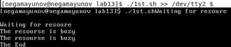
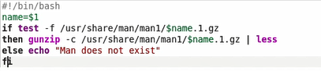
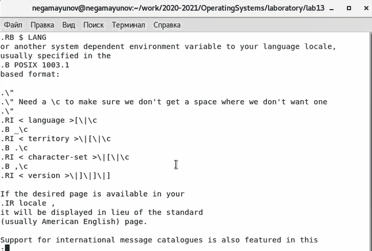
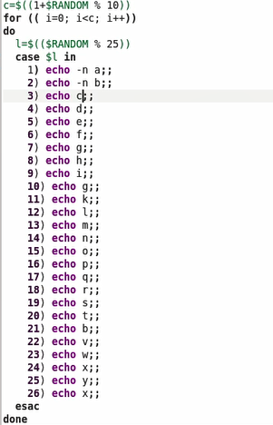
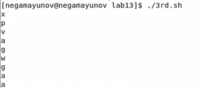

<!-- _class: titleslide -->
# Лабораторная работа №14
### Выполнил Гамаюнов Никита, 1032201719, НПМбд-01-20

---
# Прагматика выполнения работы
**Цель работы**
Приобрести простейшие навыки разработки, анализа, тестирования и отладки приложений в ОС типа UNIX/Linux на примере создания на языке программирования С калькулятора с простейшими функциями.

**Задания**
1. Создать файлы для корректной работы калькулятора
2. Изучить Makefile, исправить имеющийся шаблон
3. На практике воспользоваться gcc для отладки приложения
4. Проверить код с помощью splint

---

# Процесс выполнения работы

 Написал командный файл, реализующий упрощённый механизм семафоров.

 

---
Реализовал команду man с помощью командного файла.

 

---

Используя встроенную переменную $RANDOM, написал командный файл, генерирующий случайную последовательность букв латинского алфавита.

 

---

<!-- _class: titleslide -->
# Выводы
Я изучил основы программирования в оболочке ОС UNIX/Linux и научился писать более сложные командные файлы.