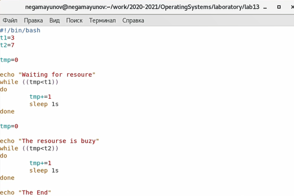
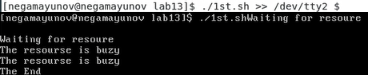
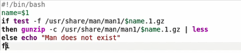
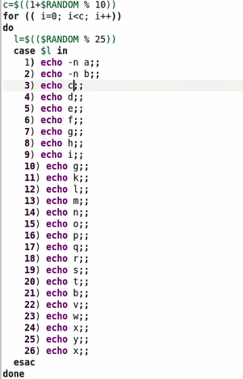
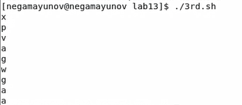

 

# Лабораторная работа №13 

**По дисциплине Операционнные системы** 

Выполнил Гамаюнов Н.Е., студент ФФМиЕН РУДН, НПМбд-01-20, 1032201717

Преподаватель Кулябов Дмитрий Сергеевич

Москва, 2021 г.

 

# Цель работы
Изучить основы программирования в оболочке ОС UNIX. Научиться писать более сложные командные файлы с использованием логических управляющих конструкций и циклов.

# Задания
1. Написать командный файл, реализующий упрощённый механизм семафоров.
2. Реализовать команду man с помощью командного файла.
3. Используя встроенную переменную $RANDOM, написать командный файл, генерирующий случайную последовательность букв латинского алфавита.

# Выполнение лабораторной работы
1. - Написал командный файл, который должен в течение некоторого времени t1 дожидаться освобождения ресурса, выдавая об этом сообщение, а дождавшись его освобождения, использовать его в течение некоторого времени t2<>t1, также выдавая информацию о том, что ресурс используется соответствующим командным файлом (процессом) *(рисунок 1)*

     

        Рисунок 1

   - Запустил командный файл в одном виртуальном терминале в фоновом режиме, перенаправив его вывод в другой (>> /dev/tty#, где # — номер терминала куда перенаправляется вывод), в котором также запущен этот файл, но не фоновом, а в привилегированном режиме *(рисунок 2)*

        

     Рисунок 2. Сверху - фрагмент графического интерфейса, во второй - терминал tty2. Как мы видим, в терминале результат работы выводился дважды: один раз текст выводил первый процесс, второй - второй.

2. Реализовал команду man с помощью командного файла. 
   - Изучил содержимое каталога /usr/share/man/man1. В нем находятся архивы текстовых файлов, содержащих справку по большинству установленных в системе программ и команд (*рисунок 3)*

        

        Рисунок 3
 
     Каждый архив можно открыть командой less сразу же просмотрев содержимое справки. Командный файл получает в виде аргумента командной строки название команды и в виде результата выдаёт справку об этой команде или сообщение об отсутствии справки, если соответствующего файла нет в каталоге man1.

     В методических материалах написано, что архив можно сразу открыть командой less. Однако, когда я попытался это сделать, вывод содержал множество текстовых артефактов, что делало справку практически нечитаемой *(рисунок 4)*. Поэтому я решил предварительно разархивировать архивы с помощью команды gunzip с ключом -c (позволяющим не удалять исходный архив) *(рисунок 5)*. Результат выполнения команды *./2nd.sh man* показан на рисунке 6.

        

        Рисунок 4

        

        Рисунок 5

        

        Рисунок 6. Хотя вывод и не идентичен выводу man, информация о команде читаема, её можно понять.

3. Используя встроенную переменную $RANDOM, написал командный файл, генерирующий случайную последовательность букв латинского алфавита. Принцип работы очень прост: мы получаем случайную длину строки (от 1 до 10), затем получаем номер для каждой буквы, соответствующий номеру этой буквы относительно начала латинской алфавита (начиная с нуля). И с помощью оператора выбора case выводим нужную нам букву *(рисунок 7)* Результат выполнения - *рисунок 8*.

    

    Рисунок 7

    

    Рисунок 8

# Выводы 
В ходе выполнения лабораторной работы я изучил основы программирования в оболочке ОС UNIX/Linux и научился писать более сложные командные файлы с использованием логических управляющих конструкций и циклов.

# Контрольные вопросы
1. $1 необходимо взять в кавычки, чтобы учесть пробелы в записи.
2. Самый простой способ объединить две или более строковых переменных — записать их одну за другой: 
    VAR1="Hello,"

   VAR2=" World"

   VAR3="\$VAR1\$VAR2"
    
   echo "$VAR3"

   Последняя строка будет отображать объединенную строку:
   
   >Hello, World 

    Источник [routerus.com | Конкатенация строк в Bash](https://routerus.com/bash-concatenate-strings/)

3. Команда seq в Linux используется для генерации чисел от ПЕРВОГО до ПОСЛЕДНЕГО шага INCREMENT.

    Синтаксис:

    *seq [OPTION]... LAST*

    или *seq [OPTION]... FIRST LAST*

    или *seq [OPTION]... FIRST INCREMENT LAST*

    Параметры:

- seq LAST: если задан только один аргумент, он создает числа от 1
до LAST с шагом шага, равным 1. Если LAST меньше 1, значение
is не выдает.
- seq FIRST LAST: когда заданы два аргумента, он генерирует числа
от FIRST до LAST с шагом 1, равным 1. Если LAST меньше FIRST,
он не выдает никаких выходных данных.
- seq FIRST INCREMENT LAST: когда заданы три аргумента, он
генерирует числа от FIRST до LAST на шаге INCREMENT . Если
LAST меньше, чем FIRST, он не производит вывод.
- seq -f «FORMAT» FIRST INCREMENT LAST: эта команда
используется для генерации последовательности в
форматированном виде. FIRST и INCREMENT являются
необязательными.
- seq -s «STRING» ПЕРВЫЙ ВКЛЮЧЕНО: Эта команда
используется для STRING для разделения чисел. По умолчанию
это значение равно /n. FIRST и INCREMENT являются
необязательными.
- seq -w FIRST INCREMENT LAST: эта команда используется для
выравнивания ширины путем заполнения начальными нулями.
FIRST и INCREMENT являются необязательными.

    Источник [espressocode.top | команда seq](http://espressocode.top/seq-command-in-linux-with-examples/)

    В bash работу этой команды можно реализвать с помощью for или while.

4. 3
5.  - В zsh более быстрое автодополнение для cd с помощью Тab
    -  В zsh существует калькулятор zcalc, способный выполнять
вычисления внутри терминала
    - В zsh поддерживаются числа с плавающей запятой
    - В zsh поддерживаются структуры данных «хэш»
    - В zsh поддерживается раскрытие полного пути на основе 
неполных данных
     - В zsh поддерживается замена части пути
    - В zsh есть возможность отображать разделенный экран, такой же как разделенный экран vim

    Источник - [habr.com | zsh и bash: что выбрать](https://habr.com/ru/post/162339/)

6. Верен
7. Из плюсов стоит отметить, что bash установлен по умолчанию на многих дистрибутивах MacOS и Unix, довольно прост в освоении и обладает мощным арсеналом команд для манипуляций с файловыми системами. А ещё есть возможность упрощать работу с помощью самописных скриптов.

    К недостаткам же я бы отнес тот факт, что bash, всё-таки, не является языком общего назначения, и его скрипты нельзя без манипуляций запустить на других операционных системах. Да и родные утилиты порой замедляют работу скриптов, запуская много новых процессов.

# Библиография

- [Кулябов Д. С. и др. Операционные системы. Методические рекомендации к лабораторной работе №11](https://esystem.rudn.ru/pluginfile.php/1142090/mod_resource/content/2/008-lab_shell_prog_1.pdf)
- [Кулябов Д. С. и др. Операционные системы. Методические рекомендации к лабораторной работе №13](https://esystem.rudn.ru/pluginfile.php/1142096/mod_resource/content/2/010-lab_shell_prog_3.pdf)
- [routerus.com | Конкатенация строк в Bash](https://routerus.com/bash-concatenate-strings/)
- [habr.com | zsh и bash: что выбрать](https://habr.com/ru/post/162339/)